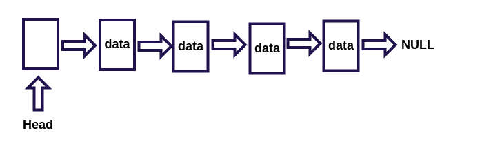

之前我们用数组的方式来实现了队列，是否还记得在出队列后有这样一段代码：
```javascript
for (i = 0; i < this.length - 1; i++) {
    this.dataStore[i] = this.dataStore[i + 1];
}
```
我们为了删除一个元素，导致了整个数组元素的前移，显然这是非常低效的！尤其是当元素很多时。我们可以使用链表这种数据结构，来删除元素的时候而不必让后面的元素向前移动。



一个节点的上一个节点称为它的**前驱**，下一个节点即next指向的节点称为它的**后继节点**，在简单的单向链表中，第一个节点称为**头节点**它没有前驱节点，最后一个节点没有后继节点(为NULL)。关于头节点head其实是可有可无的，但是一般都会加上这个数据为空的节点，保存当前链表信息，如果一个链表的头节点找不到了，那么将会导致整个链表的丢失。

# ADT
我们来看抽象数据类型的结构：
```javascript
Node，单个节点
- element，节点数据
- next，下一个节点的指针

LinkList，链表的信息与方法
- insert，插入节点
- find，查找一个节点
- remove，删除一个节点
- findPrevious，查找节点的前驱节点
- print，打印链表
```

# JavaScript完整描述
```javascript
function Node (element) {
	this.element = element;
	this.next = null;
}
function LinkList () {
	this.head = new Node('head');
}
LinkList.prototype = {
	constructor: LinkList,
	insert: function (target, element) {
		var newNode = new Node(target);
		var current = this.find(element);
		newNode.next = current.next;
		current.next = newNode;
		return this;
	},
	find: function (target) {
		var currentNode = this.head;
		while (currentNode.element !== target) {
			currentNode = currentNode.next;
		}
		return currentNode;
	},
	remove: function (element) {
		var preNode = this.findPrevious(element);
		if (preNode.next !== null) {
			preNode.next = preNode.next.next;
			return true;
		}
		return false;
	},
	findPrevious: function (element) {
		var current = this.head;
		while (current.next !== null && current.next.element !== element) {
			current = current.next;
		}
		return current;
	},
	print: function () {
		var current = this.head.next;
		var str = '';
		while (current) {
			str += current.element + '->';
			current = current.next;
		}
		console.log(str.substr(0, str.length-2));
	}
}
```

# 分析
## 插入节点
0. 通过find方法找到要插入的节点位置target
1. 创建新的节点
2. 当前节点的next指向target的next
3. target.next指向新节点

在插入的最后我们返回了this是为了方便进行链式插入。

算了直接看图：


## 删除节点
0. 找到要删除元素的前驱preNode
1. 将preNode的下一个节点指向preNode的下一个节点(要删除的节点)的下一个节点

> 如果遍历整个链表都没找到要删除的节点将会返回最后一个节点，而最后一个节点的下一个节点是NULL，所以，这样的删除操作会失败，返回false

# 测试
```javascript
var list = new LinkList();
list.insert('jiavan1', 'head').insert('jiavan2', 'jiavan1').insert('jiavan3', 'jiavan2').insert('jiavan4', 'jiavan3');
list.print(); // jiavan1->jiavan2->jiavan3->jiavan4
list.remove('jiavan2'); // true
list.print(); // jiavan1->jiavan3->jiavan4
list.remove('none'); // false
```

这只是最简单的一种链表，复杂点的还有双向链表，循环链表，我们将用另外的文章实现。

