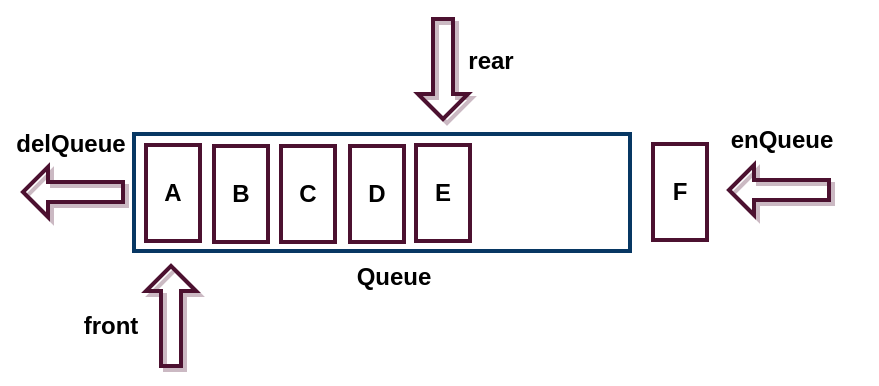

队列(Queue)是一种先进先出(First-In-First-Out, FIFO)的数据结构，与栈不同的是，它操作的元素是在两端，而且进行的是不一样的操作。向队列的**队尾加入**一个元素叫做**入队列(enQueue)**，向队列的**队首删除**一个元素叫做**出队列(delQueue)**.



# ADT
```
Queue
---
length，属性，队列长度
dataStore，属性，存储数据
enQueue，方法，入队列
delQueue，方法，出队列
empty，方法，清空队列
front，方法，获得队首元素
rear，方法，获得队尾元素
print，方法，打印队列
```

# JavaScript描述
```javascript
// 构造函数
function Queue () {
	this.length = 0;
	this.dataStore = [];
}
```

```javascript
// 原型核心方法
Queue.prototype = {
	constructor: Queue,
	enQueue: function (element) {
        // 存储元素并使队列长度加1
		this.dataStore[this.length++] = element;
	},
	delQueue: function () {
		var res = this.dataStore[0], //取得队首元素
			i;

        // 当队列不为空
		if (res !== undefined) {
            
            // 这里尽量避免使用js语言特性来实现
            // 取出队首元素，并让队列后方元素向前移动，队列长度减一
            // js数组其实已经实现了队列的方法，删除队首shift
			if (this.length > 1) {
				for (i = 0; i < this.length - 1; i++) {
					this.dataStore[i] = this.dataStore[i + 1];
				}
				this.dataStore.length -= 1;
			} else {
                // 当只有一个元素时，出队列后数组为空
				this.dataStore = [];
			}
			this.length -= 1;
		}

		return res;
	},
}
```

```javascript
// 其他方法
empty: function () {
    this.dataStore.length = 0;
    this.length = 0;
},
front: function () {
    return this.dataStore[0];
},
rear: function () {
    return this.dataStore[this.length - 1];
},
print: function () {
    for (var i = 0; i < this.length; i++) {
        console.log(this.dataStore[i] + '\n');
    }
}
```

# 测试
```javascript
var q = new Queue();
q.enQueue('jiavan');
q.enQueue('jiavan2');
q.enQueue('jiavan3');
q.enQueue('jiavan4');
q.print();
q.delQueue(); // jiavan
q.length; // 3
q.front(); //jiavan2
q.rear();// jiavan4
q.empty();
q.dataStore; //[]
```